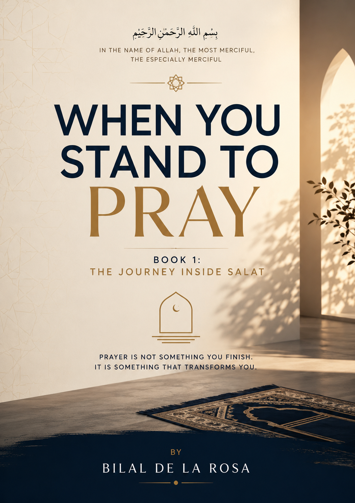

# From Heart to Hearts Projects

## Free Islamic Books, Reflections, and Resources

Assalamu Alaikum wa Rahmatullahi wa Barakatuh,

Welcome to From Heart to Hearts Projects.

This project was created to provide free Islamic books and reflections that help strengthen faith, deepen understanding, and bring hearts closer to Allah.

---

## 📖 When You Stand to Pray

A personal reflection on Salah and the relationship between a servant and their Lord.

[📥 Download Book 1 (PDF)]
(When_You_Stand_To_Pray_Book_1.pdf)
Whether your iman is strong, weak, or somewhere in between, this book is written for anyone seeking to reconnect with Allah through prayer.

### Download Book

[Download When You Stand to Pray](When_You_Stand_To_Pray_Book_1.pdf)

---

## Future Releases

📖 The Five Prayers (Coming Soon)

More books and resources will be added here, in shaa Allah.

---

© Bilal De La Rosa

Permission is granted to copy, share, distribute, and transmit this work in its entirety for non-commercial purposes, provided proper attribution is given and the content is not altered.
